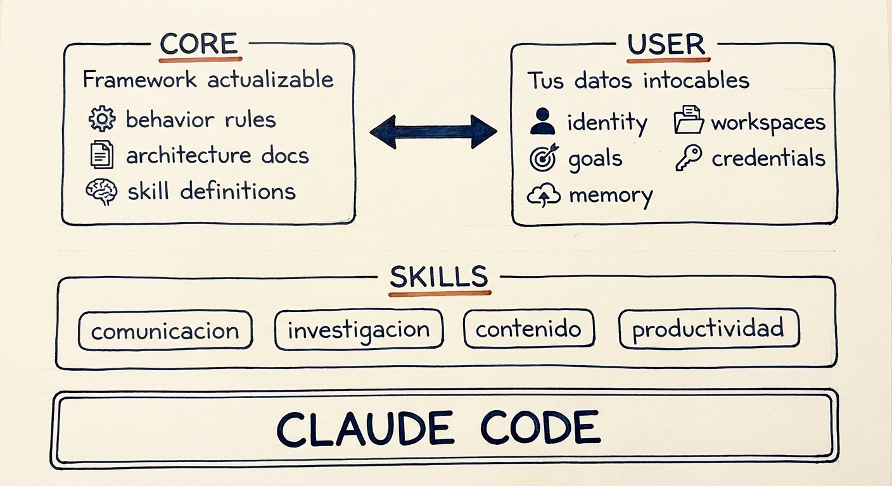
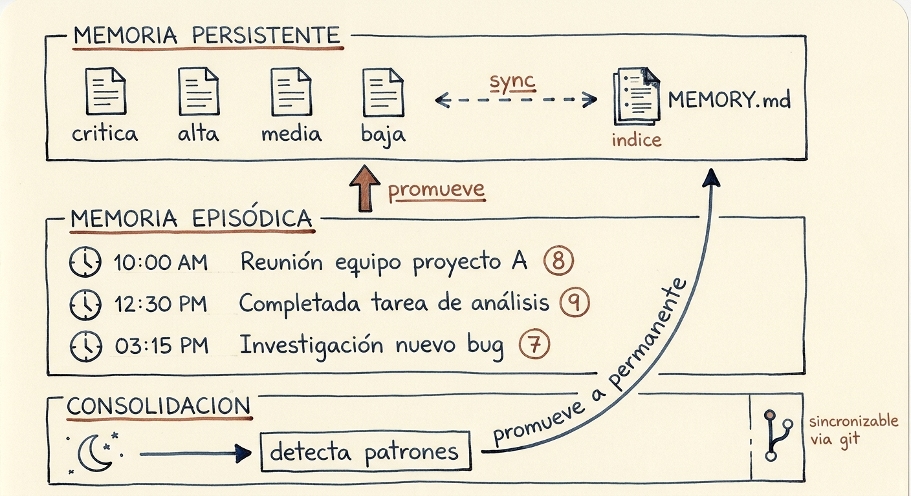

# Claudia OS

Me llamo Sergi y esto es un sistema que he montado para convertir Claude Code en un asistente personal que me conoce, recuerda lo que hemos hecho juntos y se conecta con mis herramientas del día a día: correo, calendario, Telegram, notas...

Llevo meses usándolo a diario y funciona. Así que lo he empaquetado para que cualquiera pueda instalarlo, hacer un onboarding de 10 minutos y tener su propia Claudia adaptada a su vida.

[Primeros pasos](#primeros-pasos)

---

## Por qué existe esto

Los asistentes de IA ya tienen algo de memoria. Custom GPTs, Gems, el auto-memory de Claude Code... Pero es una memoria superficial, opaca, limitada y que no controlas.

Yo quería algo distinto: un sistema que viviese en mi máquina, con mis datos, bajo mis reglas. Que me conociese porque tiene mi contexto escrito en ficheros que yo puedo leer y editar, no en una caja negra. Y que se integrase con mis herramientas, mis flujos de trabajo y que fuese lo más autónoma posible.

De ahí salió Claudia. Lo configuré una vez y a partir de ahí ha ido creciendo conmigo.

La filosofía completa y la inspiración detrás del proyecto: [PHILOSOPHY.md](PHILOSOPHY.md)

---

## Para quién es

Yo lo uso para organizar mi día a día como freelance con dos hijos pequeños, investigar temas que me interesan, buscar ángulos diferentes a mis ideas y tener todo lo que aprendo conectado en un solo sitio. Pero cada persona le acaba dando su propio uso. Algunos ejemplos:

- **Organizarte mejor.** Tareas, recordatorios, correo, calendario. Todo desde una sola conversación, sin saltar entre apps.
- **Investigar lo que te interesa.** Desde un dato puntual hasta un análisis profundo con múltiples fuentes. Lo que aprende se queda en tu base de conocimiento. Extrae y sintetiza artículos, vídeos o podcasts que tengas pendientes.
- **Pensar mejor.** Un sparring que te cuestiona, no un asistente que te da la razón. Evalúa decisiones desde distintos ángulos y te obliga a defender tus supuestos antes de actuar.
- **Crear contenido.** Si publicas contenido en redes sociales, YouTube, en una newsletter, en un blog, etc, Claudia conoce lo que ya has publicado y te ayuda con temas, borradores e investigación.
- **Tu segundo cerebro.** Todo lo que capturas, investigas y aprendes se queda en una base de conocimiento que crece contigo. A diferencia de las herramientas de notas tradicionales, Claudia no solo almacena: conecta lo que sabe con lo que haces.

Algunos usuarios le darán más uso en temas profesionales. Otros para organización familiar o de desarrollo personal. En cualquiera de los casos, el asistente funciona bien.

https://github.com/user-attachments/assets/de050d3e-4f21-4ac0-8438-1eb29ea13ff7

*Un ejemplo de cómo trabaja: le pedí que me recordara un cambio en el horario habitual de piscina. Me anotó el recordatorio para 2 horas antes. Luego le pedí que me mostrase mi calendario, se dio cuenta de que el horario del evento no cuadraba con el nuevo, y me propuso cambiarlo ella misma. Una conversación, 3 skills trabajando juntas (notas, calendario y Telegram), sin abrir ninguna app.*

**No es para ti si** buscas una app cerrada tipo SaaS, necesitas un sistema multi-usuario para equipos, o prefieres cero configuración y cero mantenimiento.

---

## Qué añade sobre Claude Code

Claude Code es potente, pero es una herramienta genérica: no sabe quién eres, no recuerda lo que hicisteis juntos ayer, y cada capacidad nueva la tienes que construir tú.

Claudia OS le da la estructura para pasar de herramienta a asistente:

<p align="center">
  
</p>

- **Memoria que persiste de verdad.** No un historial de chat ni un resumen automático. Es un sistema de memorias clasificadas por importancia, con aprendizaje episódico y un ciclo nocturno que detecta patrones recurrentes y los promueve a lecciones permanentes. Sincronizable entre dispositivos vía git.

<p align="center">
  
</p>

- **Tu contexto desde el primer momento.** Sabe quién eres, a qué te dedicas y cómo trabajas porque lo tiene escrito, no porque se lo repitas cada vez
- **Capacidades listas para usar.** Investigación, notas, correo, calendario, imagen... sin montar cada pieza desde cero
- **Tus datos siempre tuyos.** Separación estricta entre el framework y lo personal, actualizas sin perder nada
- **Funcionando en 10 minutos.** Un onboarding guiado que convierte un Claude genérico en tu asistente personalizado

---

## Qué incluye

Las skills sin marca en "Requiere" funcionan desde el primer minuto. Las demás necesitan una API key o cuenta externa (todas con tier gratuito). Puedes usar una sola skill sin instalar el sistema completo. Cada una funciona de forma independiente.

**Investigar y aprender**

| Skill | Qué hace | Requiere |
|-------|----------|----------|
| `claudia-research` | Investigación en tres niveles (rápida, estándar, profunda). En modo profundo lanza agentes en paralelo que contrastan fuentes, buscan perspectivas contrarias y generan un informe estructurado | — |
| `claudia-wisdom` | Extrae conocimiento accionable de cualquier URL: vídeos de YouTube, artículos, podcasts, newsletters. Detecta el formato, sintetiza y conecta automáticamente con tu base de conocimiento existente | — |
| `claudia-thinking` | Tres modos de razonamiento: **Council** (deliberación multi-perspectiva para decisiones), **Red Team** (destruir un plan antes de ejecutarlo) y **First Principles** (reconstruir desde los axiomas) | — |
| `claudia-critique` | Análisis crítico de textos argumentativos: evalúa solidez con el framework Paul & Elder (8 elementos + 9 estándares), detecta falacias lógicas y sesgos cognitivos. Incluye modo auto-critique para revisar tus propios borradores antes de publicar | — |
| `claudia-intake` | Pipeline asíncrono de contenido: encola URLs desde cualquier canal, las procesa en batch y genera un briefing dual (Telegram + email) con lo más relevante | — |

**Organizar tu día**

| Skill | Qué hace | Requiere |
|-------|----------|----------|
| `notes` | Captura tareas, ideas y recordatorios por lenguaje natural. Detecta la intención ("anota que...", "recuérdame el lunes...") y organiza automáticamente | — |
| `claudia-calendar` | Lee y gestiona Google Calendar: crea, modifica y borra eventos | Google Apps Script (gratuito) |
| `claudia-gmail` | Lee, busca, etiqueta, redacta borradores y envía correo. Crea borradores por defecto para que tú apruebes antes de enviar | Google OAuth2 (gratuito) |

**Crear y producir**

| Skill | Qué hace | Requiere |
|-------|----------|----------|
| `claudia-image` | Genera imágenes con estilos configurables que se guardan como perfiles reutilizables para mantener coherencia visual | Google AI Studio (gratuito) |
| `claudia-corpus-sync` | Sincroniza tu archivo de contenido publicado (YouTube, Substack) para que Claudia conozca tu voz y estilo | — |

**Sistema**

| Skill | Qué hace | Requiere |
|-------|----------|----------|
| `telegram-bot` | Bot bidireccional para hablar con Claudia desde Telegram. Si activas automatizaciones, puedes recibir briefing diario de tu calendario, recordatorios de tareas... Tiene soporte para notas de voz e imágenes | Telegram Bot Token (gratuito) |
| `memory-search` | Búsqueda en memoria persistente con ranking por relevancia | — |
| `claudia-scrape` | Extrae contenido de cualquier URL: webs, tweets, threads completos, podcasts. Usada por research y wisdom | — |
| `claudia-yt-transcript` | Descarga subtítulos y clips de vídeos de YouTube. Usada por wisdom y corpus-sync | — |

---

## Requisitos

**Lo único imprescindible:** [Claude Code](https://claude.ai/code) con plan Pro o Max. Tiene app de escritorio para macOS y Windows.

Git, Python 3.10+ y Node.js 18+ son necesarios para algunas skills, pero si no los tienes instalados Claudia puede guiarte durante el proceso.

**Integraciones opcionales** (todas con tier gratuito):
- Google OAuth para `claudia-gmail` y `claudia-calendar`
- Token de Telegram para el bot y recordatorios automáticos
- API key de Google AI Studio para generación de imágenes

Las skills que no requieren nada externo funcionan desde el primer minuto.

---

## Primeros pasos

**Si vas a usar la app de escritorio de Claude Code:**

1. Descarga este repositorio: botón verde **"Code"** → **"Download ZIP"** y descomprime la carpeta.
2. Abre Claude Code → **File → Open Folder** → selecciona la carpeta descargada.

**Si vas a usar la terminal:**

```bash
git clone https://github.com/sergi-rz/claudia-os
cd claudia-os
claude
```

En cualquiera de las interfaces donde trabajes, escribe `/claudia-onboarding` en la sesión que se abre. Claudia te guía por el resto (~5-10 minutos), incluyendo cómo crear tu propio repositorio privado para guardar tu configuración si lo quieres.

https://github.com/user-attachments/assets/e09f19c9-c8cb-4aa5-83ae-f5cf4fe4eb23

*Ejemplo de onboarding*

---

## Qué puedes hacer en tu primera hora

Estas preguntas funcionan desde el primer minuto, sin configurar nada más.

**Investigar algo que necesitas saber hoy**
> "Investiga qué están cobrando los consultores de marketing digital en España en 2025. Dame rangos por tipo de servicio y fuentes."

**Extraer lo útil de un contenido que tienes pendiente**
> "Dame los puntos clave de este vídeo y qué puedo aplicar a mi trabajo como freelance: https://youtube.com/..."

**Capturar una tarea antes de que se te olvide**
> "Anota que el lunes tengo que enviar la factura de marzo al cliente Acme y revisar el contrato nuevo."

**Tomar una decisión con más cabeza**
> "Tengo que decidir si acepto un proyecto nuevo o me centro en el cliente que ya tengo. Ayúdame a pensarlo bien: pros, contras, y qué me estoy dejando fuera."

**Analizar lo que hace un competidor o referente**
> "Mira la home de esta web y dime en 5 puntos en qué se diferencia de lo que yo ofrezco, y qué podría copiar: https://..."

---

## Modos de despliegue

**Local.** Se puede usar desde la app de escritorio de Claude Code (macOS y Windows) o desde la terminal.
- ✓ Sin infraestructura adicional, funciona en tu propio ordenador
- ✗ Las tareas automatizadas (recordatorios, briefing diario) se programan desde las tareas programadas de Claude Code y solo funcionan con el ordenador encendido

**VPS / Servidor.** Un servidor dedicado donde Claudia vive de forma permanente.
- ✓ Las tareas automatizadas funcionan a cualquier hora sin depender de tu ordenador local
- ✓ Bot de Telegram para interactuar con Claudia siempre disponible
- ✗ El setup inicial es algo más complejo: hay que contratar un VPS y configurarlo

He creado una [guía paso a paso](VPS.md) explicando cómo configurar Claudia OS en un VPS.

> **Nota sobre multidispositivo:** sincronizar la instancia entre varios equipos es posible usando un repo privado en GitHub como puente, pero requiere gestión manual (pull/push en cada equipo) y puede variar bastante según el setup. No está soportado de forma oficial en el onboarding. Es territorio DIY por ahora.

---

## Cómo evoluciona esto

Claudia OS no es un producto terminado que instalas y usas tal cual. Es una base que va mutando contigo. Cada corrección, cada skill que añades, cada preferencia que aprende, va convirtiendo tu instancia en algo que ya no se parece a la de nadie más. Dos personas que la instalen hoy y la usen durante un mes acabarán con sistemas completamente distintos. Eso no es un efecto secundario: es el objetivo.

Una vez clonado, el repo es tuyo. Lo que hagas con tu instancia no depende de que nadie publique nada.

**Personalizar.** Todo lo tuyo vive en `user/` (identidad, memoria, workspaces, credenciales). Puedes editar esos ficheros directamente o pedirle a Claudia que lo haga por ti.

**Extender.** Si necesitas una skill que no existe, puedes pedirle a Claudia que la construya. Se guarda en tu instancia sin tocar el core. También puedes contribuir skills al repo público para que las usen otros.

**Blueprints.** No instalas código rígido: instalas una intención que Claudia adapta a tu forma de trabajar. Un blueprint describe qué debería hacer una skill (por ejemplo, una rutina de revisión semanal para consultores), y tu Claudia lo convierte en una skill personalizada para ti, adaptada a las fuentes y herramientas que ya uses. Los publica la comunidad o los escribes tú.

**Actualizaciones del core.** Cuando se publiquen mejoras en las skills o el framework, puedes incorporarlas con `/claudia-update`. La separación estricta entre `core/` y `user/` garantiza que tus datos, tu identidad y tus configuraciones no se tocan.

→ Hoja de ruta y próximos pasos: [ROADMAP.md](ROADMAP.md)

---

## Seguridad y autonomía

Claudia puede operar herramientas reales: enviar correos, gestionar tu calendario, ejecutar código. Configura siempre las restricciones adecuadas para tu caso. El fichero `user/context/constraints.md` define qué puede hacer de forma autónoma y qué requiere tu confirmación.

→ [Política de seguridad](SECURITY.md)

---

## Comunidad y contribución

Claudia OS es un proyecto en desarrollo activo. Si encuentras un bug, tienes una idea para una skill nueva, o quieres mejorar la documentación, las contribuciones son bienvenidas.

→ [Cómo contribuir](CONTRIBUTING.md). Guía completa con el flujo de PR y las reglas de separación core/user.

---

## Créditos

Claudia OS se inspira en la metodología de [PAI](https://github.com/danielmiessler/Personal_AI_Infrastructure) de Daniel Miessler y muchas skills se basan en las que tiene PAI.

Otras fuentes: 

- [agentic-stack](https://github.com/codejunkie99/agentic-stack) para el patrón de memoria persistente.
- [pensamiento-critico](https://github.com/omixam/pensamiento-critico) de Maximo Gavete para el análisis crítico de textos argumentativos (skill `claudia-critique`).

Ver [ATTRIBUTION.md](ATTRIBUTION.md) para detalles.

---

## Sobre el autor

Hecho por [Sergi Ruiz](https://sergiruiz.es). Claudia OS nace de mi propio uso diario como freelance y creador de contenido. Es el asistente personal que utilizo para organizar trabajo, investigación, contenido y proyectos propios.

- Web: [sergiruiz.es](https://sergiruiz.es)
- X: [@sergi_rz](https://x.com/sergi_rz)
- YouTube: [youtube.com/@sergi-ruiz](https://youtube.com/@sergi-ruiz)
- Newsletter: [desdelacueva.sergiruiz.es](https://desdelacueva.sergiruiz.es)
